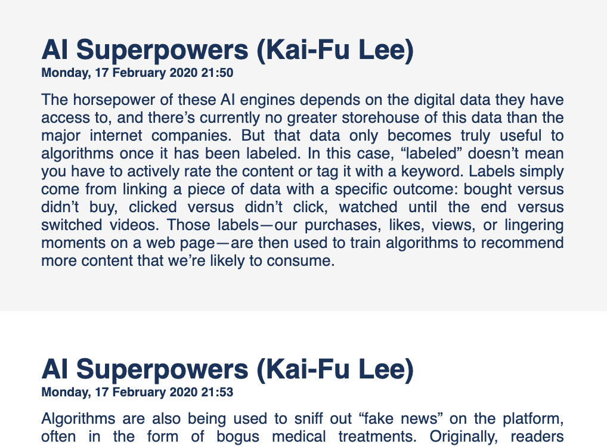
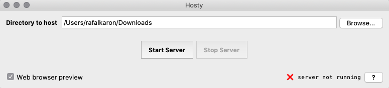


# Klipps 
[Klipps](https://github.com/rafalkaron/klipps){:target="_blank" title="Klipps on GitHub"} enables you to export your Kindle clippings to a static site.  
You can open the exported static site in any web browser and share it with others.

## Kindle clippings
When you highlight a sentence in Kindle, the sentence is saved to the [My Clippings.txt](assets/media/klipps/My%20Clippings.txt){:target="_blank" title="Sample Kindle clippings file"} file. The file often packs interesting content but it always looks dull.  

{:width="420px;" .center .shadow}

## Exporting Kindle clippings
You can use Klipps to convert your Kindle clippings to a static site in three simple steps.

1. By using a USB cable, connect your Kindle to a PC or Mac.
2. Download Klipps.
3. Run Klipps.  
**Result:** The [My Clippings.html](assets/media/klipps/My%20Clippings.html){:target="_blank" title="Sample Klipps output"} file is saved to your desktop and automatically opened in your web browser.  
{: title="Sample Klipps output" .shadow .center width="580px;"}

## Related links 
 * [Klipps on GitHub](https://github.com/rafalkaron/Klipps){:target="_blank"}
{: .links}

# Hosty 
[Hosty](https://github.com/rafalkaron/hosty){:target="_blank" title="Hosty on GitHub"} enables you to host a website on a local web server without the need to open a terminal.

## Interface
{: .shadow}

## Use cases
Hosty comes in handy if you want to locally:
 * Test or troubleshoot a website or a web app
 * Preview a static site  

Some advanced WebHelps may need to be hosted on a web server to display content correctly.
{: .note}

## Related links
 * [Hosty on GitHub](https://github.com/rafalkaron/Hosty){:target="_blank"}
 * [MDN: What is a web server?](https://developer.mozilla.org/en-US/docs/Learn/Common_questions/What_is_a_web_server){:target="_blank"}
{: .links}

# importaint
[importaint](https://github.com/rafalkaron/importaint){:target="_blank" title="importaint on GitHub"} is a CLI tool that enables you to compile a CSS file with `@import` rules into a resolved CSS file without the `@import` rules.

## Interface
```
Compile a CSS file with imports into a resolved CSS file without imports.

positional arguments:
  input_path            a filepath or URL to a CSS file with imports that you
                        want to compile

optional arguments:
  -h, --help            show this help message and exit
  -out output_dir, --output output_dir
                        manually specify the output folder. For remote files,
                        defaults to desktop. For local files, defaults to the
                        input file folder.
  -m, --minify          minify the compiled CSS
  -rc, --remove_comments
                        remove comments from the compiled CSS
  -c, --copy            copy the compiled CSS to clipboard
  -v, --version         show program's version number and exit
```

## Example
importaint resolves both local and external imports.
### Before
The following example shows an **uncompiled CSS** file with two `@import` rules.
```css
@import url("modules/module_a.css");
@import url("https://rafalkaron.github.io/modules/module_b.css");

/* list items */
li {
    margin: 0.8rem 0;
}
```
### After
The following example shows a **compiled CSS** file with resolved `@import` rules.
```css
/* resolved module_a.css */
p {
  margin-top: 5rem;
}

/* resolved module_b.css */
a {
    text-decoration: none;
    border-bottom: 0.25rem solid blue;
}

a:hover,
a:active,
a:focus {
    color: blue;
}

/* list items */
li {
    margin: 0.8rem 0;
}
```

## Extra features
Apart from compiling CSS files, importaint enables you to:
 * Define a custom output directory
 * Remove `/* comments */` from the compiled CSS code
 * Minify the compiled CSS code
 * Copy the compiled CSS code to clipboard

## Use cases
importaint is useful if you want to:
 * Optimize your CSS code
 * Implement a single compiled CSS file
 * Keep your code modular and produce monoliths for your customer

## Related links
 * [importaint on GitHub](https://github.com/rafalkaron/importaint){:target="_blank"}
 * [MDN: @import](https://developer.mozilla.org/en-US/docs/Web/CSS/@import){:target="_blank"}
{: .links}

# MarkUP
[MarkUP](https://github.com/rafalkaron/markup){:target="_blank" title="MarkUP on GitHub"} is a CLI tool that enables you to batch-convert Markdown or HTML to DITA. 

## Interface
```
Batch-convert Markdown and HTML files.

positional arguments:
  input                 provide a filepath to a file or a folder with files that you want to convert
  convert               set the conversion type:
                         * md_dita - convert Markdown to DITA
                         * html_dita - convert HTML to DITA
                         * md_html - convert Markdown to HTML
                         * html_md - convert HTML to Markdown

optional arguments:
  -h, --help            show this help message and exit
  -v, --version         show program's version number and exit
  -out output_dir, --output output_dir
                        manually specify the output folder (defaults to the input folder)
```

## Conversion types
MarkUP supports the following conversion types:
 * Markdown → DITA
 * HTML → DITA
 * Markdown ↔ HTML

## Example
The following example shows a Markdown file converted to DITA. 

Currently, MarkUP converts content only to DITA concept topics. You may need to refactor DITA after the conversion.
{:.note}

### Before
```markdown

```
### After
```xml

```

## Use cases
MarkUP is useful if you want to:
 * Migrate your Markdown or HTML documentation to DITA
 * Convert HTML to Markdown or vice versa

## Related links
 * [MarkUP on GitHub](https://github.com/rafalkaron/markup){:target="_blank"}
 * [Markdown Guide](https://www.markdownguide.org/){:target="_blank"}
 * [DITA Specs](http://docs.oasis-open.org/dita/dita/v1.3/dita-v1.3-part3-all-inclusive.html){:target="_blank"}
{: .links}

# PrincePal
[PrincePal](https://github.com/rafalkaron/princepal){:target="_blank" title="PrincePal on GitHub"} is a CLI tool that enables you to efficiently PDF documents produced with [Prince](https://www.princexml.com/){:target="_blank"}.

## Prerequisites
To use PrincePal, you need to install Prince first. For more information, see the [Prince Installation Guide](https://www.princexml.com/doc/installing/).

## Interface
```
Preview your PDFs like a prince!

optional arguments:
  -h, --help            show this help message and exit
  -v, --version         show program's version number and exit
  -rm, --remove_pdfs    USE WITH CAUTION: Permanently remove PDF files from
                        the script directory
  -nopr, --no_preview   prevent PDFs from opening after publication
  -yolo, --you_live_only_once
                        combine with the '-rm' argument to permanently remove
                        the PDF files from the script directory without
                        confirmation.
  -jobs jobs, --concurrent_jobs jobs
                        determine the number of concurrent jobs (defults to
                        12)
  -cwd, --current_working_directory
                        Use HTML files in the script directory as an input
  -i INPUT, --input INPUT
                        Pick a source file or source folder on your own
  -o OUTPUT, --output OUTPUT
                        Pick the output folder on your own
  -s STYLE, --style STYLE
                        Pick the output folder on your own
```

## Features
PrincePal enables you to:
 * Batch-convert HTML files and open preview for the converted PDF files
 * Specify CSS styling for conversion
 * Specify input and output directories
 * Specify the number of concurrent jobs
 * Delete PDF files from the script directory

## Use cases
PrincePal makes developing Prince PDF styling easier by enabling you to preview multiple content sets.

## Related links
 * [PrincePal on GitHub](https://github.com/rafalkaron/princepal){:target="_blank"}
 * [Prince Converter](https://www.princexml.com/){:target="_blank"}
{: .links}

# rafalkaron.github.io
I designed and developed this very site from scratch.

## Technologies
I used the following technologies to develop [rafalkaron.github.io](https://rafalkaron.github.io){:target="_blank"}:

Ruby
: Setting up local Jekyll development environment.

Liquid
: Outputting variables and controlling template logic.

HTML
: Specifying modular page layout.

SCSS
: Styling the site for multiple viewports.

YAML
: Defining site configuration, metadata, and contact information.

Kramdown
: Developing content.
{: .two_column}

## Related links
 * [r-jekyll-theme on GitHub](https://github.com/rafalkaron/r-jekyll-theme)
 * [Jreel - Social media icons on jekyll](https://jreel.github.io/social-media-icons-on-jekyll/){:target="_blank"}
 * [Allejo - jekyll-toc](https://github.com/allejo/jekyll-toc){:target="_blank"}
{: .links}
